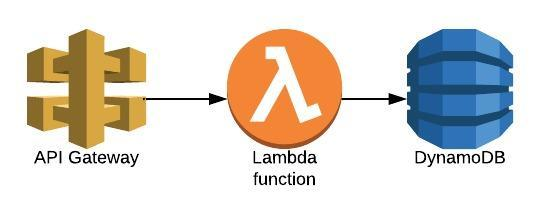

# cruddyAPI


The purpose of this RESTful CRUD API is to manage profile data.

## Routes
* [Create profile](docs/createProfileContract.md)
    * `POST api/v1/profiles`
* [Read / retrieve profile](docs/getProfileContract.md)
    * `GET api/v1/profiles/{id}`
* [Update profile](docs/updateProfileContract.md)
    * `PUT api/v1/profiles/{id}`
* [Delete profile](docs/deleteProfileContract.md)
    * `DELETE api/v1/profiles/{id}`
* [Health](docs/healthContract.md)
    * `GET api/v1/health`

## Requirements
### Deployment Requirements
* [Golang](https://golang.org/dl/) >= 1.11
* [Terraform](https://www.terraform.io/downloads.html) >= 0.12.8
* [AWS](https://aws.amazon.com/) Credentials
    * Infrastructure costs fit comfortably within AWS' Free-Tier with typical development usage
### Local Development Requirements
* All of the above
* [Docker](https://docs.docker.com/v17.12/install/)
* [DynamoDB-local Docker Image](https://hub.docker.com/r/amazon/dynamodb-local/)

## Usage
### Deployment
```bash
git clone https://github.com/teohrt/cruddyAPI.git
cd cruddyAPI
go mod download
make deploy
```

### Local Development
This requires two terminals. One to run the local db, and one to run the API server.
To Set up the local db, run the command
```bash
make db-start
```

Now, initialize the db table in another terminal and start the API server with these commands:
* This app listens to API Gateway requests by default. To make it accessible to normal http requests, comment out line 37 and uncomment lines 17 and 35 in file "app/app.go"
```bash
make db-table-init
make run-locally
```


## Licence
See LICENSE.
